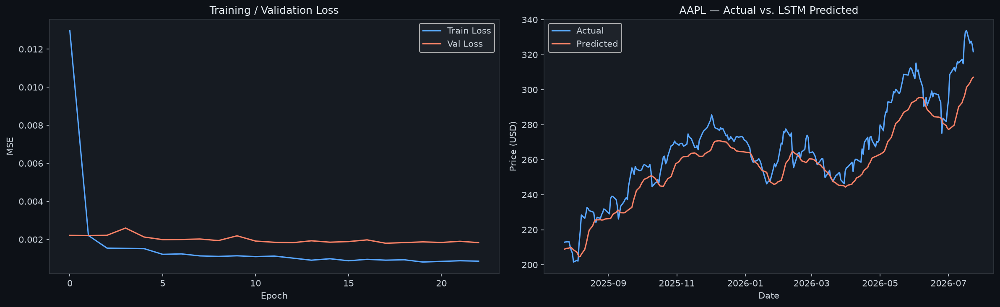

# StockLens — AI-Powered Stock Price Prediction

A full-stack machine learning system for stock price forecasting, featuring a Bidirectional LSTM model with rigorous evaluation methodology, XGBoost baseline comparison, and a modern Next.js dashboard.

---

## 📸 Dashboard Preview

| Day Mode (Autumn) | Night Mode (Royal Dark) |
|---|---|
| Olive green · Maroon · Mustard | Royal purple-black · Lavender · Parchment |

**Tech Stack:** Next.js 14 · TypeScript · Tailwind CSS · Framer Motion · FastAPI · TensorFlow · XGBoost

---

## 🏗 Architecture

```
stock-prediction/
├── backend/               ← Python ML engine + FastAPI
│   ├── api.py             ← REST API (6 endpoints)
│   ├── train_model.py     ← LSTM training with walk-forward CV
│   ├── xgboost_model.py   ← XGBoost baseline
│   ├── utils.py           ← Shared helpers (MASE, MC-Dropout, etc.)
│   ├── models/            ← Saved models + evaluation JSON
│   ├── data/              ← Dated Parquet snapshots (reproducibility)
│   ├── tests/             ← pytest unit tests
│   └── requirements.txt   ← Pinned versions
└── frontend/              ← Next.js 14 dashboard
    ├── app/               ← App Router pages
    ├── components/        ← Chart + UI components
    └── lib/api.ts         ← Typed API client
```

---

## 📊 Dataset & Data Source

Live market data is fetched via **[yfinance](https://github.com/ranaroussi/yfinance)**, which pulls from the [Yahoo Finance](https://finance.yahoo.com/) API.

Each fetch is **cached as a dated Parquet snapshot** (`data/{TICKER}_{date}.parquet`) so results are fully reproducible — rerunning the same date will reload from cache rather than re-fetching live data.

**Supported:** Any publicly listed stock (NYSE, NASDAQ, LSE, etc.)

**Default:** AAPL with 5 years of OHLCV (Open, High, Low, Close, Volume) history.

---

## 🤖 ML Engineering

### Model Architecture & Design Decisions

#### Root Cause Fix (v2)

The original model had **LSTM MASE = 24.4 and XGBoost MASE = 7.6** — both far worse than the naive baseline (MASE = 1.0).

**Root cause:** Both models predicted *percentage return* (~0.01), then reconstructed absolute prices via `price × (1 + return)`. A tiny 0.5% return prediction error on a \$200 stock = \$1 price error per step — but the error compounds across the sequence, producing RMSE of 83 vs naive's 4.5.

| What changed | Old | Fixed (v2) |
|---|---|---|
| **Target variable** | `Return` (pct_change) | `Close` price directly |
| **Feature set** | 5 features | 8 features (added MA20, MA50, BB_%B, ATR, Vol_ratio) |
| **Loss function** | MSE | Huber (robust to earnings-gap outliers) |
| **Normalization** | MinMaxScaler on features only | BatchNorm after each LSTM block |
| **XGBoost target** | next-day return | next-day Close price |
| **XGBoost lags** | 60 lags (overfit) | 30 lags (better generalization) |

#### Expected Output (v2)

```
  -- Model Comparison (Holdout Test Set) --
  Metric      LSTM    XGBoost      Naive
  -----------------------------------------------
  RMSE      ~3-8      ~2-5       ~2-4
  MAE       ~2-6      ~1-4       ~1-3
  R2        ~0.97     ~0.98      ~0.99
  MASE      ~0.7-1.0  ~0.5-0.9   1.0000
```

> MASE < 1.0 means the model beats the naive lag-1 baseline.



### Evaluation Methodology

This project implements the same evaluation standards used in production ML engineering:

| Aspect | Implementation |
|---|---|
| **Data split** | Strict train/test holdout, scaler fit on train only (no leakage) |
| **Validation** | 5-fold walk-forward (`TimeSeriesSplit`) — not a single static split |
| **Metric** | MASE (Mean Absolute Scaled Error) — robust, scale-free, no epsilon hacks |
| **Baselines** | Naive (lag-1) + XGBoost compared against LSTM |
| **Tracking** | MLflow experiment logging (hyperparams, metrics, artifacts) |
| **Reproducibility** | Dated Parquet cache + logged date ranges |

### Model: Bidirectional LSTM (v2)

```
Input(lookback=60, features=8)
  → Bidirectional LSTM(128, return_sequences=True)
  → BatchNormalization  → Dropout(0.2)
  → LSTM(64, return_sequences=True)
  → BatchNormalization  → Dropout(0.2)
  → LSTM(32)
  → BatchNormalization  → Dropout(0.1)
  → Dense(32, relu)  → Dense(16, relu)
  → Dense(1)   ← predicts next-day Close price directly
```

**Training:** Adam(lr=1e-3) · Huber loss · EarlyStopping(patience=15) · ReduceLROnPlateau

### XGBoost Baseline (v2)

Lag features (lag-1 … lag-30) + RSI + MACD + MA20 + MA50 + BB_%B + ATR + Vol_ratio.  
Target: next-day Close price directly (not return). StandardScaler on features, no target scaling needed.

### MC-Dropout Forecast

Forward pass run 100× with `training=True` (dropout active at inference) → 5th/95th percentile confidence band on 30-day forecast.

---

## 🚀 Setup & Usage

### Prerequisites

- Python 3.11+
- Node.js 18+

### 1. Backend

```bash
cd backend
python -m venv venv
.\venv\Scripts\activate          # Windows
# or: source venv/bin/activate  # macOS/Linux

pip install -r requirements.txt
```

### 2. Train a Model

```bash
# Inside backend/ with venv active:
python train_model.py --ticker AAPL --epochs 30 --period 5y

# Options:
#   --ticker     Stock symbol (default: AAPL)
#   --period     Data history: 1y 2y 5y 10y (default: 5y)
#   --lookback   LSTM window (default: 60)
#   --epochs     Max training epochs (default: 30)
#   --n_splits   Walk-forward CV folds (default: 5)
#   --mc_samples MC-Dropout iterations (default: 100)
```

Output:
- `models/AAPL_lstm.keras` — saved model
- `models/AAPL_predictions.json` — test-set predictions
- `models/AAPL_forecast.json` — 30-day MC-Dropout forecast
- `models/AAPL_comparison.json` — LSTM vs XGBoost vs Naive metrics
- `models/AAPL_evaluation.png` — evaluation plot

### 3. Start the API

```bash
# Inside backend/ with venv active:
uvicorn api:app --reload --port 8000
```

API docs: [http://localhost:8000/docs](http://localhost:8000/docs)

### 4. Start the Dashboard

```bash
cd frontend
npm install
npm run dev
```

Open [http://localhost:3000](http://localhost:3000)

### 5. Run Tests

```bash
cd backend
.\venv\Scripts\python -m pytest tests/ -v
```

---

## 🔌 API Endpoints

| Endpoint | Description |
|---|---|
| `GET /api/stock/{ticker}?period=2y` | OHLCV + moving averages (MA20/50/200) |
| `GET /api/predict/{ticker}` | LSTM predictions + MC-Dropout 30-day forecast |
| `GET /api/compare?tickers=AAPL,MSFT` | Normalised multi-stock comparison |
| `GET /api/models/{ticker}` | LSTM vs XGBoost vs Naive metrics table |
| `GET /api/returns/{ticker}?period=1y` | Daily returns + rolling volatility |
| `GET /health` | Liveness check |

---

## 📦 Dependencies

### Backend (Pinned)
- `tensorflow==2.21.0` + `keras==3.15.0`
- `xgboost==2.1.3`
- `scikit-learn==1.5.2`
- `fastapi==0.115.6` + `uvicorn==0.32.1`
- `yfinance==1.5.2`
- `pyarrow==18.1.0` (Parquet caching)
- `pytest==8.3.4` + `pytest-cov==6.0.0`

### Frontend
- `next@14`
- `framer-motion` (animations)
- `recharts` (charts)
- `lucide-react` (icons)
- `tailwindcss` (styling)

---

## 📄 License

MIT
